# 安装

```
npm init vite-app vue3-app-vite
npm i
npm run dev
```

# 与vue3的区别

```html
main.js

// vue2
const app = new Vue(options)
Vue.use()
app.$mount('#app')

// vue3
//不存在构造函数vue
const app= createApp(App);
app.use
app.mount('#app');
```

```html
 vue3中this指向的改变
vue2this指向组件实例
vue3中抛出了一个代理
```

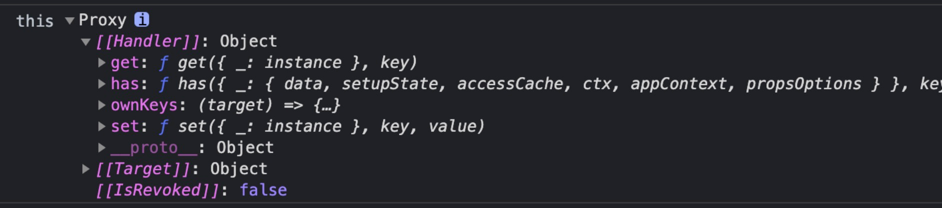

```js
composition
api
文档地址：https://cn.vuejs.org/guide/extras/composition-api-faq.html


    1.
setup函数

setup函数是一个新的组件选项。作为在组件内使用
Composition
API
的入口点。
setup函数在beforeCreate之前执行
setup函数中的this指向的是undefined
setup函数中给予响应式后，为一个对象，在template模版渲染时，是一个实例，所以模版中并不需要.value

setup()
{
    console.log(this) //undefined

}

//简化setup函数，防止setup函数中写一堆逻辑，可以抽离出来，放到一个函数中，然后在setup函数中调用
<template>
    count:{{countRef}}
</template>
<script>
    import {ref, onMounted, onUnmounted} from 'vue'
    function useXXX() {
    let countRef = ref(0)
    const increase = () => {
    countRef.value++
    return {
    countRef,
    increase}
}

    export default {
    setup() {
    return {
    ...useXXX()
}
}
}
}
</script>

```

```js
//监听数据变化
watchEffect(() => {


    console.log('countRef', countRef)
})

//当我们想让setup函数足够简洁，数据操作和监听可以在外部执行
//新建composition文件夹，新建useXXX.js文件
import {ref, watchEffect} from 'vue'

export default function useXXX() {
    let countRef = ref(0)
    const newTodoRef = ref('')
    const todosRef = ref([])
    watchEffect(() => {
        //当数据变化时可以执行一些操作
        console.log('countRef', countRef)
    })
    const addTodo = () => {
        //    新增一个
        todosRef.value.push({
            id: Date.now(),
            title: newTodoRef.value,
            completed: false
        })
    }
    const increase = () => {
        countRef.value++
    }
    return {
        countRef,
        increase,
        newTodoRef,
        todosRef,
        addTodo
    }
}

//在页面上使用
<template>
    count:{{countRef}}
    <button
    @click="increase">+
</button>
<input type="text" v-model="newTodoRef">
    <button
    @click="addTodo">add
</button>
<ul>
    <li v-for="todo in todosRef"
    :key="todo.id">{{todo.title}}
</li>
</ul>
</template>
<script>
    import useXXX from './composition/useXXX'
    export default {
    setup() {
    const {countRef, increase,todosRef} = useXXX()
    return {
    countRef,
    increase,
    todosRef
}
}
}
</script>

```

```js

```

```js

```

# 细节记录

### 1. vue2中 v-for优先级高于v-if，不建议一起使用；vue3中v-if优先级高于v-for所以一定 不能一起使用， 可以合理利用计算属性。

### 2. vue3中组件可以绑定多个数据，并且可以增加一些附加方法，比如trim

   ```html
<!--父组件-->
<CheckEdit v-model="item.checked" v-model:title.trim="item.title" v-for="item in product"
           :key="item.id"></CheckEdit>
   ```

   ```vue
<!--子组件-->
<template>
	<div class="wrapper">
		<div class="checkbox"
			 :class="{checked:modelValue}" @click="handleChecked">
		</div>
		<input type="text"
			   :value="title" @input="handleInput">
	</div>
</template>

<script>
export default {
	name: "CheckEdit",
	props: {
		modelValue: Boolean,
		title: String,
		titleModifiers: {
			default: () => {
				{
				}
			}
		}
	},
	setup(props, ctx) {
		const handleChecked = () => {
			console.log('ctx', ctx);
			ctx.emit("update:modelValue", !props.modelValue)
		}
		const handleInput = (e) => {
			//修饰符去掉空格
			props.titleModifiers.trim ? e.target.value = e.target.value.trim() : null
			ctx.emit("update:title", e.target.value)
		}
		return {
			handleChecked,
			handleInput
		}
	},
}
</script>

<style scoped>
.wrapper {
	display: flex;

}

.checkbox {
	width: 12px;
	cursor: pointer;
	margin-right: 2px;
	height: 12px;
	border: 1px solid;
}

.checked {
	background -color: red;
}

</style>


 ```

## 组件增加修饰符

去掉title的首尾空格，在子组件中添加titleModifiers属性（命名规定xxxModifiers）， 接收修饰符，然后在input事件中判断是否有trim修饰符，有则去掉首尾空格。

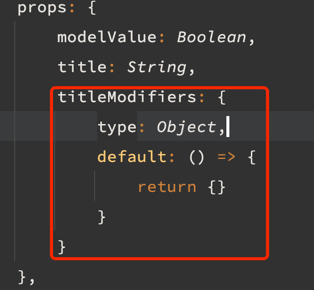
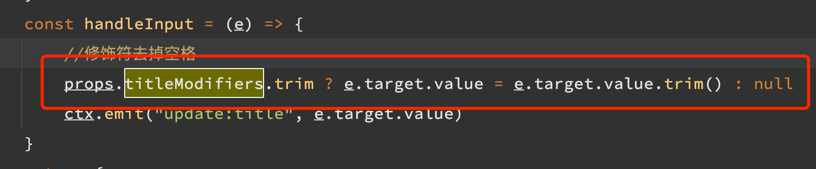

当在循环中出现v-for和v-if需要同时使用的场景时，例如：当你只想展示数据中select：true的数据时，可以使用计算属性来实现。

```vue

<template>
	<div>
		<div v-for="item in selectList" :key="item.id">
			{{item.title}}
		</div>
	</div>
</template>
<script>
import {computed, ref} from 'vue'

export default {
	setup() {
		const list = ref([
			{id: 1, title: '1', select: true},
			{id: 2, title: '2', select: false},
			{id: 3, title: '3', select: true},
			{id: 4, title: '4', select: false},
		])
		const selectList = computed(() => {
			return list.value.filter(item => item.select)
		})
		return {
			selectList
		}
	}
}
</script>
```

## 一个页面中的组件异步加载

```vue

<template>
	<div>
		<Box1></Box1>
		<Box2></Box2>
	</div>
</template>
<script>
import {defineAsyncComponent, h} from 'vue'
import Loading from './loading.vue'
import Error from './error.vue'

const Box1 = defineAsyncComponent(() => import('./components/box1'))
const Box2 = defineAsyncComponent(() => import('./components/box2'))
//组件中包含加载动画
const Box3 = defineAsyncComponent({
	loader: () => import('./components/box3'),
	loadingComponent: Loading,  //加载中组件
	errorComponent: Error,  //加载失败组件
	// errorComponent: {  //也可以直接写组件
	// render() {
	//   return h('div', '加载失败')
	//   }
	// }
	delay: 200,
	timeout: 3000,
})
export default {
	components: {
		box1,
		box2
	}
}
</script>


```

可以将上述异步加载写在utils工具中，方便调用,详见utils目录下

### 3. router的变化，详情见router下目录

```js
import {createRouter, createWebHistory} from "vue-router"
import routes from "./routes";

export default createRouter({
    history: createWebHistory(), // => mode:history
    routes
})

```

### 4. vue3可以改变组件的dom逻辑结构。 你可以把你的组件放到页面中任意dom层级下

```html
<!--将此内容放在body里-->
<Teleport to="body">
    <comp>这是你写的组件</comp>
</Teleport>
```

### 5. reactivity api 监听响应式数据变化的api

```js
import {reactive, readonly, ref, computed} from 'vue'

const state = reactive({a: 1, b: 2})
window.state = state
//此时obj对象为proxy，可以监听到内部数据的变化,

//readonly只能读取代理对象中的成员，不可以修改
const imState = readonly({a: 1, b: 2})

//ref可以代理任何数据
const imState = ref({a: 1, b: 2})
const imState = ref(0)
const comp = computed(() => {
}) // 计算属性只有调用comp.value改变时才会执行


//应用
让一个对象变成响应式数据 => reactive / ref
让一个对象的所有属性只读 => readonly
让一个非对象数据变为响应式数据 => ref
根据已知的响应式数据得到一个新的响应式数据 => computed


```

监听数据变化watchEffect/watch(相当于vue2的watch)

```js
import {watchEffect, reactive, ref} from 'vue'

const state = reactive({a: 1, b: 2})
const count = ref(0)

const stop = watchEffect(() => {
    console.log(this.state.a)
    //该函数会立即执行，响应式数据变化后再执行
})
state.a++
//通过stop函数，停止监听
stop()


```

```
通过watch属性监听数据变化，例如将20变为90。中间的动画过程使用gsap实现
```

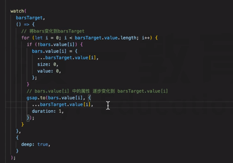

转换unref,toRef

```js
unref等同于:isRef(val) ? val.value : val

```

```js
toRef:得到一个响应式对象某个属性的ref格式
const state = reactive({
    a: 1,
    b: 2
})
const Ref1 = toRef(state, 'a') //Ref1:{value:...}

```

```js
toRefs:把一个响应式对象的所有属性转换为ref格式, 然后包装到一个plain - object中返回

const state = reactive({
    foo: 1,
    bar: 2
})

const stateAsRefs = toRefs(state)
/**
 * stateAsRefs
 * {
 *     foo:{value:...}
 *     bar:{value:...}
 *     
 * }
 */

```

```js
//使用场景
setUp()
{
    const ref1 = reactive({a: 1})
    return {
        ...toRefs(ref1)
    }
}

function t() {
    const pos = reactive({x: 0})
    return pos
}

setUp()
{
    const {x} = toRefs(t())
}
```

### 6. compositionApi使用规范

```
(1)所有composition function都以ref的结果返回，以保证setup函数的返回结果中
不包含reactive或readonly产生的数据

```

```js
function usePos() {
    const pos = reactive({x: 0, y: 0})
    return toRefs(pops) // {x:refObj,y:refObj}
}

function useBooks() {
    const books = ref([])
    return {
        books //books:is refObj
    }
}

function useUser() {
    const user = readonly({
        isLogin: false,
        id: null
    })
    return toRefs(user)
}

setUp()
{
    //在setup函数中尽量保证解构，展开出来的所有响应式数据是ref
    return {
        ...usePos(),
        ...useBooks(),
        ...useUser()
    }
}
```

```
组件传参数时，如果传递的是一个props对象，那么需要通过计算属性
```

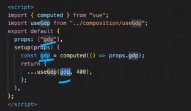

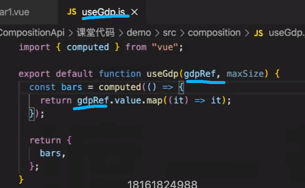

### 7.生命周期函数对比

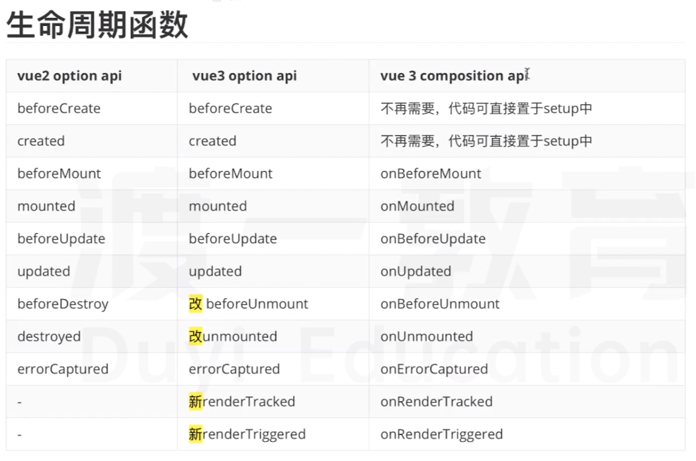

# 插件安装

1. router(使用见router目录)

```html
npm i vue-router@next
```

2.加载条

```html
npm i nprogress
```

```html
<!--utils.js引入-->
import NProgress from 'nprogress'
import 'nprogress/nprogress.css'
```

```js
/**
 * 使用
 */
router.beforeEach((to, from, next) => {
    NProgress.start()
    next()
})
```

# 如何按需引入antdesign插件

```html
npm install --save ant-design-vue
```

下载babel-plugin-import 插件

```html
npm install --save-dev babel-plugin-import
```

在babel.config.js中配置

```js
module.exports = {
    presets: [
        '@vue/cli-plugin-babel/preset'
    ],
    // 新增代码
    plugins: [
        [
            'import',
            {libraryName: 'ant-design-vue', libraryDirectory: 'es', style: true}
        ]
    ]
}
```

在 main.js 按需引入组件

```js
import 'ant-design-vue/dist/antd.css';
// 此时会自动引入对应的样式文件，无需再手动逐一引入
import {
    Button
} from 'ant-design-vue'

/
新增代码：注册特定组件
createApp(App).use(router).component(Button.name, Button).mount('#app')
```

# vue3共享数据

## 1.vue2中vuex
```
npm i vuex@next
```
```创建仓库main.js```

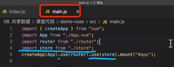

```设置store【store->loginUser】```

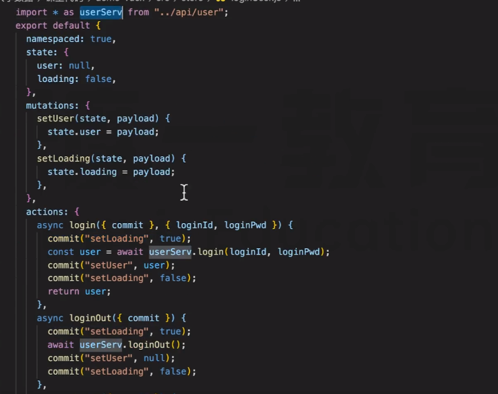

```设置store【store->index】```

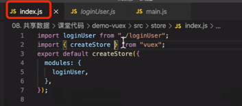

```触发store中的方法```

```js
store.dispatch('loginUser/setLoginUser', {name: 'zhangsan'})

//页面中
import {useStore} from 'vuex'
import {useRouter} from 'vue-router'

const store = useStore()
const user = store.dispatch('loginUser/setLoginUser', {name: 'zhangsan'})
const router = useRouter()
if (user) {
    //页面跳转
    router.push('/home')
}
```

```获取store```
```js
const loginUser = computed(() => store.state.loginUser)
```

```首页使用```

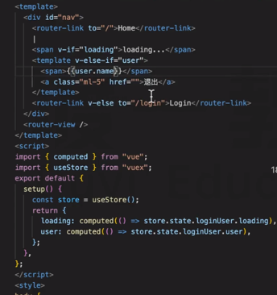

## 2.vue3中使用全局数据共享

详情见store目录下的登录demo

使用见main.js及app.vue

## 2.vue3中使用provide和inject全局数据共享


```vue
<template>
    
</template>
<!--根组件中提供数据-->
<script>
    import {provide} from 'vue'
    export default {
        setup() {
            provide('loginUser', {name: 'zhangsan'})
        }
    }
</script>
```
```vue
<!--后代组件-->
<template>
    <div>
        <h1>app</h1>
    </div>
</template>
<script>
import {inject} from 'vue'
export default {
    setup() {
        const loginUser = inject('loginUser')
        console.log(loginUser)
        return {}
    }
}   
</script>

```

